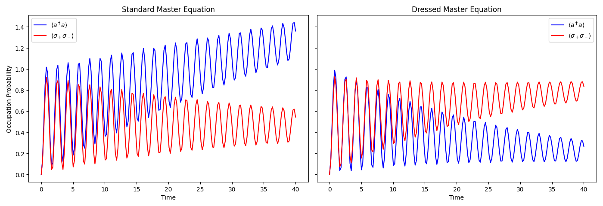
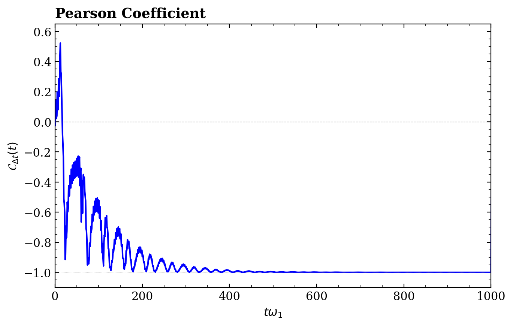
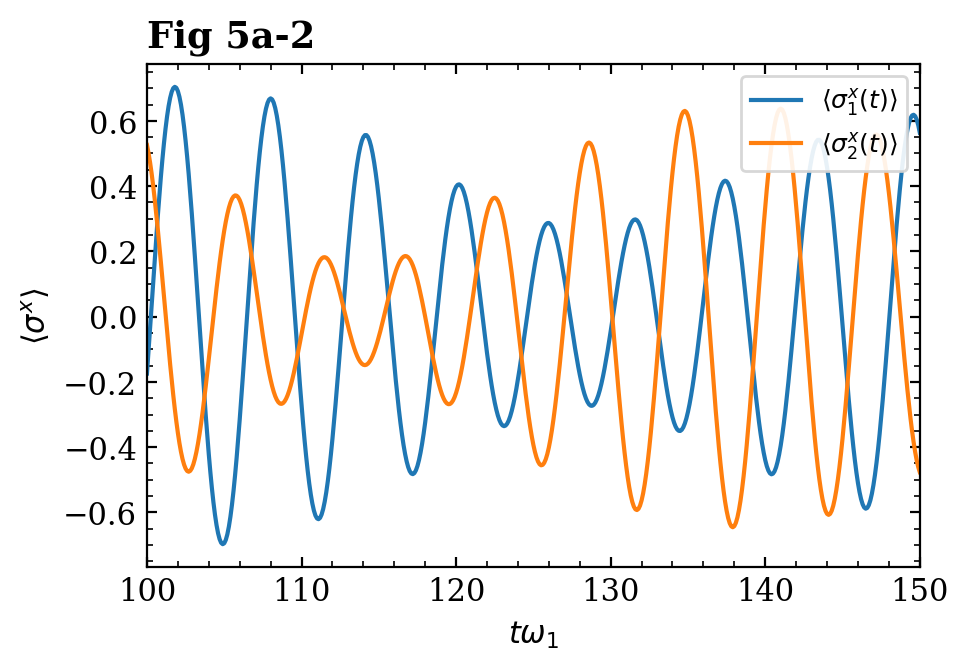
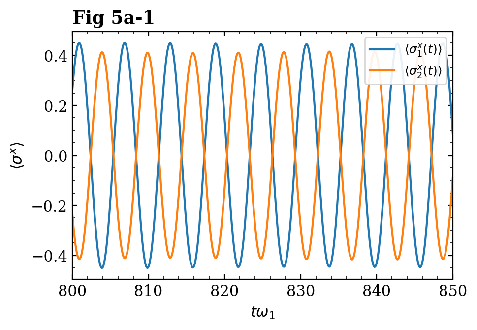
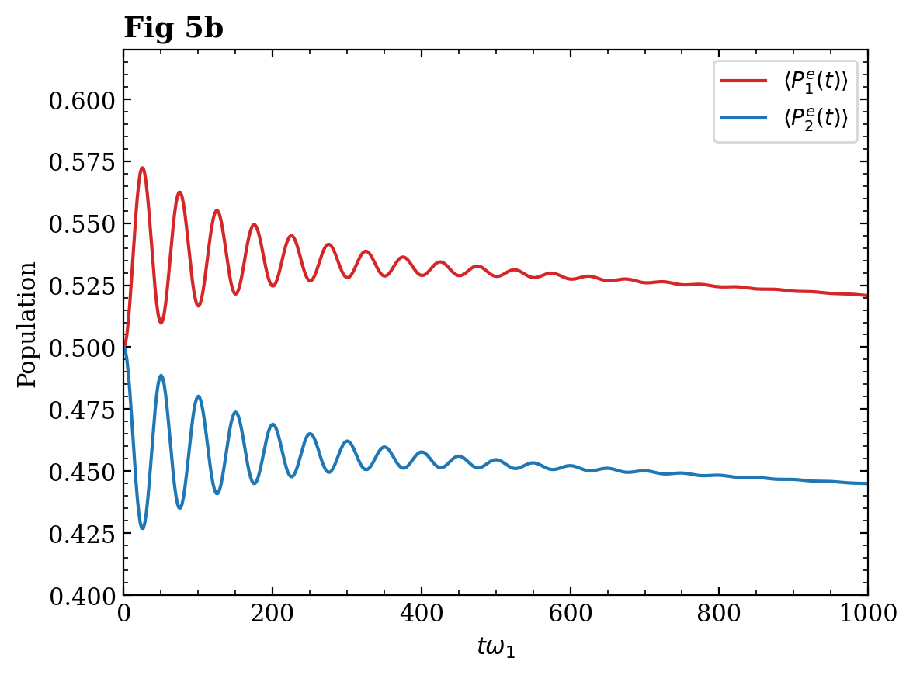
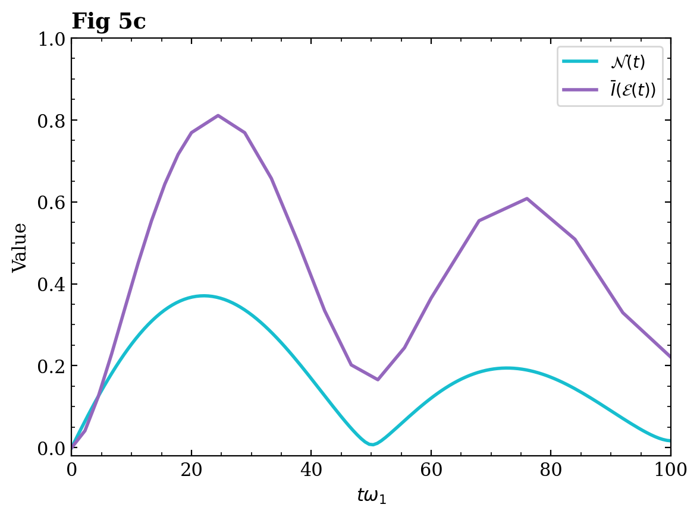

# Quantum Zeno Effect

### PHYS 437 Research Project | University of Waterloo

A computational study of the **Quantum Zeno Effect and open quantum systems**, using Python and QuTiP to simulate dissipative quantum dynamics.

## Overview

This project investigates how interactions with an environment affect quantum systems. I implemented numerical simulations to compare standard and dressed master-equation approaches and studied the behavior of qubits coupled to a shared environment.

The project involved:

- Implementing quantum-system simulations in **Python/QuTiP**
- Comparing **standard vs. dressed master equations**
- Modeling a qubit coupled to a resistor environment
- Simulating two qubits interacting through a common environment
- Analyzing synchronization, subradiance, and entanglement

## Results

### Standard vs. Dressed Master Equation

Comparison of the predicted system dynamics using the two master-equation approaches.

### Two-Qubit Dynamics

Simulation of two qubits coupled through a common environment.

## Implementation

**Languages & Tools**

- Python
- QuTiP
- NumPy
- SciPy
- Matplotlib

### Files

| File | Description |
|---|---|
| `blias_paper_simulation.py` | Standard and dressed master-equation simulations |
| `resistor_hamiltonian.py` | Qubit-resistor environment model |
| `double_qubit_simulation.py` | Two-qubit collective dynamics |

## References

The project builds on published work in open quantum systems, including research by **Beaudoin, Gambetta & Blais** and **Cattaneo et al.**

## Author

**Allen Mathew**  
University of Waterloo, Physics & Computing

[GitHub](https://github.com/allxn753)
